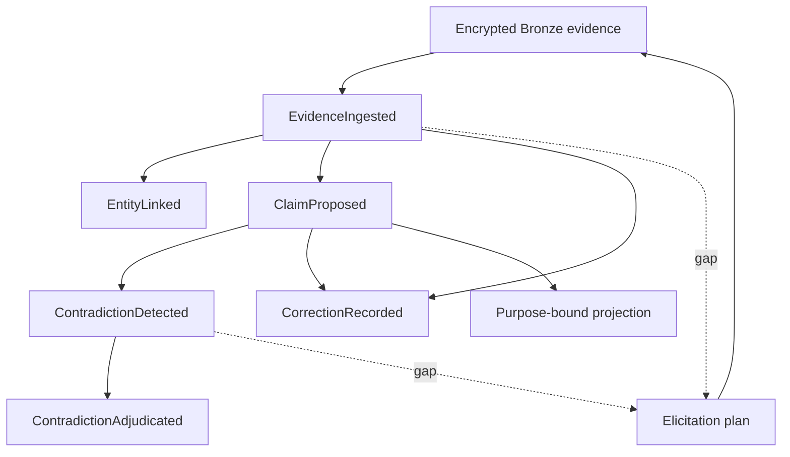
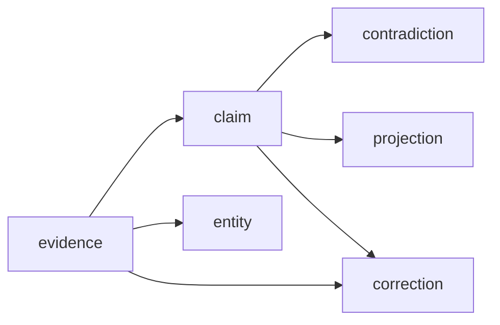

# DT-3 epistemic core

## Scope

DT-3 turns the reserved evidence, identity, claim, contradiction, review, and
correction vocabulary into executable state transitions. SQLite/WAL remains
the only required database. The lineage table is a rebuildable index over the
hash-chained event ledger; Neo4j may mirror it, but canonical writes and reads
must remain correct when Neo4j is absent.

## Authoritative transitions

| Event | Owner | Required semantic effect |
| --- | --- | --- |
| `EvidenceIngested` | ingest service | Adds immutable evidence metadata and its independence group |
| `EntityLinked` / `EntityUnlinked` | identity worker | Adds or deactivates an evidence-backed external entity link; source invalidation marks the link stale |
| `ClaimProposed` | adjudication worker | Adds a seven-dimension claim with resolvable evidence provenance |
| `ClaimAccepted` / `ClaimContested` / `ClaimRetired` | human review | Changes review state without replacing the claim |
| `ContradictionDetected` | adjudication worker | Preserves a competing-claim finding; does not alter claim status |
| `ContradictionAdjudicated` | human review | Records a resolution and optional preferred claims separately |
| `ClaimSuperseded` | human review | Links a predecessor claim to an existing successor |
| `CorrectionRecorded` | human review | Links an existing evidence/claim target to an existing replacement |

All write methods perform ownership, subject-scope, optimistic-concurrency,
and aggregate transition checks before SQLite persistence. Contradiction
adjudication intentionally does not accept, contest, retire, or supersede a
claim as a side effect. Callers append those decisions explicitly when needed.
Worker findings and human decisions carry a caller-supplied occurrence time;
generated domain IDs derive from the twin and idempotency key. Exact retries
therefore return the original append, while changed timestamps or payloads are
rejected as idempotency-key reuse.

## Reversible lineage

`dt_dependencies` stores typed, sequence-stamped edges. A covering source index
serves downstream impact and deletion invalidation; a covering dependent index
serves reverse ancestry. Recursive SQLite CTEs implement both traversals and
deduplicate cycles. Queries accept a sequence cutoff, so recorded-time lineage
cannot see edges learned later.

`LineageTrace` returns the root, all ancestors, all dependents, and evidence IDs
grouped by `independence_group`. Grouping prevents multiple parses, summaries,
or transformations of one acquisition from being presented as independent
corroboration. The event stream is authoritative; deleting and rebuilding the
lineage index must reproduce the same edges.

## Bitemporal queries

Recorded time and valid time remain separate operations:

1. `as_of_recorded_time` replays only events committed by that instant.
2. `as_of_valid_time` filters evidence, entity links, and claims by their
   half-open `[valid_from, valid_until)` interval.
3. Both may be supplied together to ask what the system knew then about facts
   valid at another time.

Valid-time filtering does not change `sequence` or `last_event_hash`; those
fields continue to identify the recorded event-stream position. Snapshots from
the pre-DT-3 state shape remain readable, with new collections initialized to
empty values.

## Point, Line, Face, Volume, and Root

`TypedRelation.topology` expresses semantic scale without encoding database
layout:

| Level | Meaning |
| --- | --- |
| Point | One atomic relation or observation |
| Line | An ordered dependency, sequence, or progression |
| Face | A bounded context joining multiple lines |
| Volume | A composite domain spanning multiple contexts |
| Root | A subject-level or constitutional anchor |

The value is part of ARGOCell JSON and generated contracts. It is not a Neo4j
label, traversal instruction, or license to infer missing edges.

## Gap-directed elicitation

`GapDirectedElicitor` deterministically detects missing claims, insufficient
independence groups, contested claims, stale lineage, and unresolved
contradictions. A plan is derived state bound to a twin, source sequence, and
canonical claim-ID set; it does not mutate the ledger. Response ingestion
rebuilds the plan from that exact recorded state and rejects any altered,
fabricated, cross-twin, or future-sequence plan before writing to Bronze.

An answer is limited to 1 MiB and written through the configured `BronzeVault`
as encrypted JSON. Only the Bronze URI, content hash, plan/question IDs,
rights, sensitivity, valid time, and one session-level independence group enter
`EvidenceIngested`. The plaintext answer and question prompt do not enter the
event payload, outbox, NATS message, or state notification. Multiple answers
from one plan deliberately share an independence group.

Bronze and SQLite cannot share a filesystem transaction. The object identity is
deterministic from subject and response ID, so an append conflict leaves a
safe, retryable encrypted object rather than duplicating or changing evidence.
A production durable workflow should retry the SQLite append and separately
reconcile encrypted objects that never acquire ledger references.

## Binding contracts

| Capability | REST | gRPC | Required scope/role |
| --- | --- | --- | --- |
| Bitemporal state | `GET /v1/twins/{twin_id}/state` | `GetState` | trusted read boundary |
| Lineage trace | `GET /v1/twins/{twin_id}/lineage/{kind}/{id}` | `TraceLineage` | `dt.lineage.read` |
| Detect contradiction | `POST /v1/twins/{twin_id}/contradictions` | `DetectContradiction` | `dt.adjudicate` / adjudication worker |
| Human adjudication | `POST .../contradictions/{id}/adjudicate` | `AdjudicateContradiction` | `dt.review` / human review |
| Correction | `POST /v1/twins/{twin_id}/corrections` | `RecordCorrection` | `dt.review` / human review |
| Elicitation plan | `POST /v1/twins/{twin_id}/elicitation/plans` | `PlanElicitation` | `dt.elicit` |
| Elicitation answer | `POST /v1/twins/{twin_id}/elicitation/responses` | `RecordElicitationResponse` | `dt.ingest` / ingest service |

REST and gRPC are language-neutral binding contracts. As in DT-2.1, host
adapters must authenticate OIDC/mTLS and map verified claims to `ActorContext`;
payload-declared roles are never trusted. Lineage endpoints expose private
evidence identifiers and therefore use a scope distinct from projection reads.

## Performance and failure behavior

- Per-twin writes remain `BEGIN IMMEDIATE` compare-and-swap transactions.
- Dependency-edge creation is in the same transaction as event and outbox.
- Forward and reverse indexes avoid event scans for ordinary lineage queries.
- Recursive queries are sequence-bounded and cycle-deduplicated.
- Latest-state caching applies only to current state; historical views replay
  from verified snapshots/events and are not silently cached across cutoffs.
- A missing optional graph/vector/bus service cannot block canonical writes or
  lineage queries.
- Deleting evidence queues all reachable derived nodes for invalidation while
  retaining the audit history required to explain the deletion.

## Remaining deployment gates

DT-3 does not claim live identity-provider, policy-engine, NATS, telemetry
collector, or optional Neo4j validation. Host control/query RPC handlers remain
an integration task. Production promotion still requires privacy review of
elicitation prompts, recovery testing for orphaned Bronze objects, numeric
retention requirements, and the DT-2.1 24-hour/2×-peak deployment soak.
