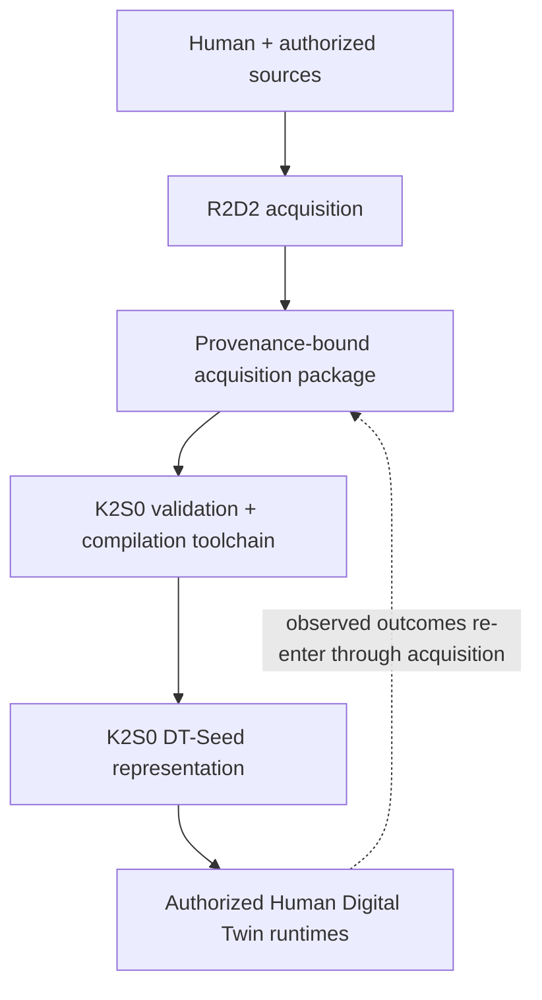

# K2S0 system boundary

## Authoritative terms

| Term | Meaning | Active behavior |
| --- | --- | --- |
| R2D2 | Interviewer and multimodal acquirer | Conducts interviews, imports authorized sources, captures context, and emits evidence packages |
| K2S0 | Portable, versioned DT-Seed/representation file | None; it is a data artifact |
| K2S0 toolchain | Validator, normalizer, identity resolver, event/state engine, compiler, signer, migrator, and reader/writer | Constructs and validates K2S0 representations |
| Human Digital Twin runtime | Authorized software that loads a K2S0 representation and supplies agent, health, embodiment, simulation, or projection behavior | Executes bounded uses without becoming canonical identity |

K2S0 is not shorthand for the interviewer or the entire deployed Human Digital
Twin. This repository may contain executable reference tooling without changing
the artifact boundary.

## Information flow

R2D2 may propose questions, interpretations, summaries, or follow-ups. Only the
deterministic toolchain may admit evidence, append authoritative transitions,
or compile a K2S0 representation. Downstream runtimes return observations or
outcomes through the same acquisition and admission boundary; they do not edit
the seed directly.

## Storage boundary

The K2S0 representation should be portable without becoming an uncontrolled
archive of raw private material. Unless an explicit container profile permits
an encrypted attachment, it contains typed state, provenance references,
content hashes, integrity material, policy/export constraints, model or asset
references, and version metadata. Raw interview recordings, medical documents,
photos, video, and other sensitive source bytes remain in authorized encrypted
evidence storage.

SQLite/WAL is the authoritative embedded ledger used by the reference
toolchain. It is not the K2S0 file format. Neo4j remains an optional rebuildable
read model and cannot define canonical representation semantics.

## Capability-track boundary

Voice, visual/embodied, and health capabilities are representation profiles and
qualification tracks, not required process boundaries. A modular deployment
may keep them in one application while isolating heavy or externally hosted
model engines behind ports.

The complete Human Digital Twin claim requires the shared core, R2D2
acquisition, voice, visual/embodied, health, cognitive, behavioral, and social
representation profiles, plus cross-domain qualification. Completion of DT-0
through DT-7 alone means the shared representation/toolchain is complete; it
does not mean every human domain has been implemented.
